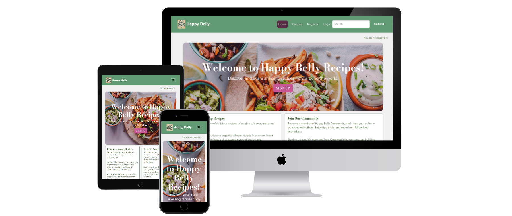
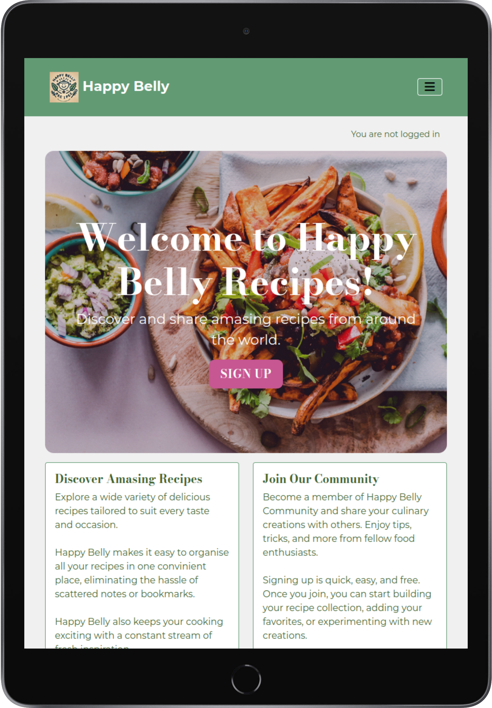

  

# Welcome to Happy Belly recipes

Welcome to Happy Belly Recipes – a responsive website where users can find easy-to-follow recipes, add their own culinary creations, and share them with other food enthusiasts. Users who are not registered, can browse recipes. By creating a personal account, users can add, edit and delete new recipes, as well as easily manage their own recipes or add recipes to favorites for easy access. 

[View the live project here](https://happy-belly-recipes-b223bbac9b55.herokuapp.com/)

This website was created as a portfolio project for the Full-Stack Software Development Programme from the Code Institute.

<em>Created by Lola Crispin</em>

# Table of Contents
- Purpose and target audience
- UX
- Agile development
- Features implemented
- Features for future development
- Technology used
- Testing and validation
- Bugs and issues
- Deployment
- Resources
- Credits and acknowledgements

# Purpose and Target Audience 
- Problem Statement: 
	- Cooking enthusiasts and home chefs often struggle to find a user-friendly platform for sharing, discovering, and managing recipes. 

- Purpose: 
	- The Happy Belly Recipes website aims to provide a platform for users to create, manage, and share their favorite recipes. It makes user interactions enjoyable, enhances recipe discovery with search and favourite options, and provides easy recipe management tools - create, edit and delete recipes. All recipes created are sent to admin for approval before publishing to ensure for security.

- Target Audience:
	- Home Chefs: People who love cooking at home and want to share and find new recipes.
	- Cooking Enthusiasts: Passionate cooks who enjoy exploring recipes, sharing feedback, and connecting with others.
	- Beginners: New cooks looking for simple recipes, tips, and advice.
	- Food Bloggers: Creators who want to showcase their recipes and engage with their audience.

# UX
## Database planning

In the project, I used the Django AllAuth User Model and custom made models:

**Django AllAuth User Model:**

|       Name        |        Type         |  Key  |
|-------------------|---------------------|-------|
| `id`              | AutoField           |  PK   |
| `username`        | CharField           |       |
| `email`           | EmailField          |       |
| `password`        | CharField           |       |

**Custom-made Recipe Model:**

|       Name       |         Type         |  Key  |
|------------------|----------------------|-------|
| `title`          | CharField            |       |
| `user`           | User Model           |  FK   |
| `slug`           | SlugField            |       |
| `description`    | TextField            |       |
| `ingredients`    | TextField            |       |
| `instructions`   | TextField            |       |
| `tag`            | TaggableManager      |       |
| `status`         | IntegerField         |       |
| `image`          | CloudinaryField      |       |
| `image_alt`      | CharField            |       |
| `serving`        | IntegerField         |       |
| `created_on`     | DateTimeField        |       |
| `updated_on`     | DateTimeField        |       |

Additional model features:
- User relationship: Each recipe is linked to the user who created it via a foreign key.
- Null handling: If a user or recipe is deleted, the corresponding favorite entry is set to NULL rather than being deleted.
- Slug generation: Slugs are automatically generated from the title and are ensured to be unique using a method "generate_unique_slug". Also a method "populate_slug" is used to automatically populate the slug field before saving.
- Status field: Controls recipe visibility with two status - Draft and Published.
- Image management: Recipes can include images managed by Cloudinary. If there is no image, the default image will be added instead.
- Tags: TaggableManager enables flexible tagging for categorising recipes.
- Ordering: Recipes are displayed in descending order.

**Custom-made Favorite Model**

|       Name       |         Type         |  Key  |
|------------------|----------------------|-------|
| `user`           | ForeignKey (User)    |  FK   |
| `recipe`         | ForeignKey (Recipe)  |  FK   |

Additional model features:
- User relationship: Connects users to their favorite recipes via foreign keys.	
- Unique constraint: Ensures a user can favorite a recipe only once.
- Null handling: If a user or recipe is deleted, the corresponding favorite entry is set to NULL rather than being deleted.

## User Stories Overview

I organised all user stories into Epics and defined acceptance criteria for each one. I also applied MOSCOW prioritisation to prioritise the user stories for development.

**Epic: User registration and authentication**
- **User registration**: As a visitor, I want to create a personal account so that I can create and manage my own recipes **(MUST)**.
  - AC1: A visitor can register an account using a username.
  - AC2: Once registered, the user can log in to their account.
  - AC3: When logged in, the user can create and manage their recipes.

- **User login and logout**: As a registered user, I want to log in and log out of my account so that I can securely access my personal recipes **(MUST)**.
  - AC1: A registered user can log in using their username and password.
  - AC2: A logged-in user can log out of their account.

**Epic: Recipe management**
- **View recipes**: As a visitor, I want to view a list of recipes so that I can browse and select recipes that I like to view in detail **(MUST)**.
  - AC1: A visitor can see a list of recipes to browse.
  - AC2: A visitor can click on a recipe title to see its detailed view.

- **Create recipe**: As a logged-in user, I want to add a new recipe so that I can share it with other users **(MUST)**.
  - AC1: A logged-in user can fill out a form with the recipe details.
  - AC2: After submission, the new recipe is sent to admin for approval and publishing.

- **Update recipe**: As a logged-in user, I want to edit a recipe I created so that I can update its details **(MUST)**.
  - AC1: A logged-in user can navigate to their recipe.
  - AC2: The user can edit the recipe details through a form.
  - AC3: Upon form submission, the recipe details are updated.

- **Delete recipe**: As a logged-in user, I want to delete a recipe I created so that I can remove it from the website **(MUST)**.
  - AC1: A logged-in user can navigate to their recipe.
  - AC2: The user can delete the recipe by confirming the deletion.
  - AC3: The recipe is removed from the website.

- **Search recipe**: As a visitor, I want to search to find quickly a specific recipe **(SHOULD)**.
  - AC1: There is a search bar in the navigation.
  - AC2: Users can search recipes using various parameters, including tags.
  - AC3: The search results display relevant recipes.

- **Favourite recipes**: As a logged-in user, I want to mark recipes as favourites so that I can easily find them later **(SHOULD)**.
  - AC1: A logged-in user can click a button to add a recipe to their favourites.
  - AC2: Favourited recipes are saved to the user’s account.
  - AC3: The user can view a list of their favourited recipes.

- **My recipes**: As a logged-in user, I want to see all recipes that I created earlier so that I can easily see them in one place **(SHOULD)**.
  - AC1: A logged-in user can click a button to see a list of their recipes.

**Epic: Administrative controls**
- **Manage Recipes**: As a site admin, I want to create, read, update, and delete any recipes so that I can manage the website content **(MUST)**.
  - AC1: A logged-in admin can create a new recipe.
  - AC2: A logged-in admin can view any recipe.
  - AC3: A logged-in admin can update any recipe.
  - AC4: A logged-in admin can delete any recipe.

## Design

### Wireframes
The Happy Belly Recipes website is designed with Bootstrap to ensure responsiveness, making it accessible on mobile, tablet, and desktop devices

I used Balsamiq to create the wireframes. They were served as initial thnking and evolved during the build in line with Agile methodology.

**Homepage:** 

    

**Welcome page:** 

    

**List of recipes:**

  

**View recipe:**

 

### Color palette
I created the following color palette for the project, using bright, vivid colors with strong contrast to ensure the design is visually appealing and provides a positive user experience.

### Typography
I used the Google fonts Montserrat and Bodoni Moda for consistent typography across the site.

### Branding
I created the logo for Happy Belly recipe with the use of ChatCPT.

# Agile Development
During the development of the Happy Belly website, I implemented an Agile methodology and utilised a Kanban board on GitHub linked to my repository.

The Kanban board was divided into the following columns:
- **To do**: This column contains user stories that are ready for development.
- **In Progress**: This column tracks user stories currently being worked on. At the time of the screenshot, two user stories (Testing and Readme files) are still in progress. These will be moved to "Done" upon completion.
- **Done**: This column holds all the tasks that have been successfully completed.
- **Backlog**: This column includes user stories that I was unable to complete (labeled as WON'T and COULD in MOSCOW prioritisation). These items can be revisited for future development.

**Kanban board:**  
 

**The following User Stories were not completed during this project and are left for future development.**

**Epic: Comment and rating (COULD)**
- **Create a comment**: As a logged-in user, I want to leave comments on a recipe so that I can provide feedback or ask questions.
  - AC1: A logged-in user can submit a comment on a recipe.
  - AC2: Comments are displayed under the recipe once approved by an admin.
  - AC3: Users can reply to comments to create a thread.

- **Read other comments**: As a user, I want to read other users’ comments on a recipe.
  - AC1: A user can read other users’ comments.

- **Modify or delete comment**: As a logged-in user, I want to edit or delete my comment on a recipe so that I can correct or remove my feedback.
  - AC1: A logged-in user can edit their comment.
  - AC2: A logged-in user can delete their comment.

- **Rate a recipe**: As a logged-in user, I want to rate a recipe so that I can share my opinion on its quality.
  - AC1: A user can submit a rating for a recipe.

**Epic: Administrative controls (WON’T)**
- **Approve Comments**: As a site admin, I want to approve or disapprove comments so that I can filter out inappropriate content.
  - AC1: A logged-in admin can approve comments.
  - AC2: A logged-in admin can disapprove comments.

- **Reset password**: As a logged-in user, I want to reset my password so that I can regain access to my account if I forget my password.
  - AC1: A user can request a password reset link via email.
  - AC2: A user can reset their password using the link provided.

- **Change profile information**: As a logged-in user, I want to update my profile information so that my account details are current.
  - AC1: A user can update their email, username, and other personal information.
  - AC2: The updated profile information is saved and displayed correctly.

- **Contact form**: As a visitor, I want to contact the site admins so that I can ask questions or report issues.
  - AC1: A visitor can fill out a contact form with their inquiry.
  - AC2: The message is sent to the site admins.

# Features Implemented

- **Homepage**
  - **Structure:** The homepage includes a navbar, hero section with a clear call to action, and a footer. The main content features a hero image with a "Sign Up" button and a brief description of the website's purpose and registration benefits.

- **User Account Management**
  - **User Registration & Login:** Visitors can create an account with a username, log in and log out securely, and manage their recipes.
  - **Welcome Page:** After registration, users see a personalised welcome message with links to create a recipe, view their recipes, and access their favorites recipes.

 

- **Recipe Management**
  - **Recipe Listings:** Recipes are displayed as paginated cards with images, titles, descriptions, and tags. All users can view the listings, and each card links to a detailed recipe view. Recipes are displayed in sets of 8, with "Previous" and "Next" buttons available below to navigate between pages.  
  - **Create, Edit, & Delete Recipes:** Logged-in users can create, update, or delete their recipes using the "Create Recipe" form. All new recipes are submitted for admin approval before being published. Users can preview their recipe before final submission, with the option to either submit it or return to editing for further adjustments. A default image is automatically added if no image is provided, ensuring each recipe has visual representation. Additionally, a slug is automatically generated based on the recipe title to create a user-friendly URL.

- **Search & Favorites**
  - **Search:** Users can search for recipes by title, description, ingredients, or tags using a search bar in the navigation.
  - **Favorites:** Logged-in users can mark recipes as favorites and view their favorited recipes on a dedicated page.

  

- **Administrative Controls**
  - **Manage Recipes:** Admins can create, view, update, or delete any recipe, ensuring proper content management across the site.

# Features for Future Development

- **Commenting & Rating**
  - **Comments:** Logged-in users can comment on recipes, read others' comments, and engage in discussions. They can also edit or delete their comments.
  - **Rating:** Users can rate recipes to share their opinions on quality.

- **Additional Account Features**
  - **Reset Password & Update Profile:** Users can reset their passwords via email and update their profile information, ensuring their account details remain current.

- **Contact Form**
  - **Communication:** Visitors can contact site admins with inquiries or issues via a contact form.

## Technology used
- Django: Web framework for building the site.
- Heroku: Platform for hosting and deployment.
- HTML & CSS: For page structure and custom styling.
- Bootstrap 5: Ensures responsive design.
- Python: Backend logic and processing.
- JavaScript: Additional functionality, like checking passwords to match during log in.
- PostgreSQL: Relational database system.
- Cloudinary: Image hosting service.
- Font Awesome: Icons for UI enhancement.
- Google Fonts: Custom typography.
- GitHub: Source code repository and agile project methodology.
- Git: Version control for code management.
- ChatGPT: create logo, images, content for the website and help during coding.

# Testing and validation

## Python
I used the CI Python Linter to check my Python files and addressed all the errors. The code now passes all checks successfully.

I checked homepage, welcome page, sign in, sign out, sign up, recipe list, view recipe, edit recipe, preview recipe, create recipe, search, my recipes, my favorites, delete recipe.

- views.py

- models.py

- forms.py

- admin.py

- urls.py

## CSS
I used the W3 CSS Validator to check my CSS file and addressed all the errors. The code now passes all checks successfully.

## HTML
I used the W3 HTML Validator to check my html files and addressed all the errors. The code now passes all checks successfully.
I checked homepage, welcome, sign in, sign out, sign up, recipe list, view recipe, create recipe, edit recipe, delete recipe, preview recipe, search, my_favourites, my recipes.

## JS
I used the JS Hint Validator to check my JS code and there were no errors.

##  Manual testing

## Account registration & authentication tests

| Test                                       | Result |
|--------------------------------------------|--------|
| User can create an account                 | Pass   |
| User can log into profile                  | Pass   |
| User can log out of profile                | Pass   |
| Welcome page displays after registration   | Pass   |

## User navigation tests

| Test                                             | Result |
|--------------------------------------------------|--------|
| User can easily navigate through the site        | Pass   |
| User can access the homepage                     | Pass   |
| User can access the recipe listing page          | Pass   |
| User can access their account dashboard welcome  | Pass   |
| User can access the favorites page               | Pass   |
| User can access the recipes page created earier  | Pass   |
| User can search for recipes using the search bar | Pass   |
| User can navigate to social links                | Pass   |

## Recipe management tests - CRUD functionality

| Test                                                       | Result |
|------------------------------------------------------------|--------|
| User can create a new recipe                               | Pass   |
| User can preview a new recipe before submission            | Pass   |
| User can edit a recipe they created                        | Pass   |
| User can delete a recipe they created                      | Pass   |
| New recipe is submitted for admin approval                 | Pass   |
| Admin can approve submitted new recipe                     | Pass   |
| New recipe is viewed correctly on recipe list page         | Pass   |
| User can see new recipe on a page with all their recipes   | Pass   |

## Recipe favorites tests

| Test                                              | Result |
|---------------------------------------------------|--------|
| User can add a recipe to favorites                | Pass   |
| User can view their list of favorited recipes     | Pass   |
| User can remove a recipe from favorites           | Pass   |

## Administrative controls tests

| Test                                                  | Result |
|-------------------------------------------------------|--------|
| Admin can create, view, update, and delete any recipe via admin panel | Pass |

##  Lighthouse testing

I used Lighhouse to generate report and overall the result was good.

##  Responsiveness

I used the Website Mockup Generator to test the website for responsivness

**Laptop**

**Tablet**

**Mobile**

# Bugs and Issues
- I plan to improve performace by using the correctly generated images rather that jpgs as currently.
- I discovered a bug related to tags appearing in the recipe description, ingredients, and instructions fields due to Summernote's handling. While I've implemented code to remove these tags, they may still appear depending on how the content is added. This will be addressed in a future release.

- The website should be also tested on different browsers and actual mobile phones to improve responsivness.

# Deployment
- I followed the Django Deployment Instructions 2024 provided by the Code Institute.
- Repository was created in Git.
- Deployed to Heroku with Debug = False.
- Connected Secret Keys to config vars.
- Connected Code Institute PostGres Database.

# Resources
- **Code Institute LMS and SME sessions**
- **Color palettes**: for creating a color palette for the project. [Color palette](https://colorpalettes.net/color-palette-2314/).
- **Design Your Way**: for information about fonts. [Fonts](https://www.designyourway.net/blog/bodoni-font-pairing/)
- **Techsini**: for creating mock ups. [Mock ups](https://techsini.com/multi-mockup/index.php)
- **Websitemockup generator**: for creating mock ups. [Mock ups](https://websitemockupgenerator.com/)
- **we3schools**
- **Bootstrap Documentation**

# Credits and acknowledgements
I would like to thank the following individuals and resources for their support and inspiration during this project:
- **Color palettes**: for creating a color palette for the project. [Color palette](https://colorpalettes.net/color-palette-2314/).
- **Design Your Way**: for information about fonts. [Fonts](https://www.designyourway.net/blog/bodoni-font-pairing/)
- **Code Institute LMS Content**: For providing the educational materials that guided my learning process.
- **Course Facilitators**: Special thanks to Alexander and David Calikes for their support and  guidance.
- **Tutor Kevin Loughrey**: His SME sessions were important in shaping my approach and were a key guidance throughout the project.
- **Tutor Mark Briscoe**: For helping me to fix an error with Preview and Editing recipe.
- **Rachel Cutler and the RecipMe Project**: Rachel's RecipMe project was a crucial reference for the structure and foundation of my work [RecipMe Django Cookbook](https://github.com/rachbry/recipme-django-cookbook/blob/main/README.md).
- **Influential Projects**: I also drew inspiration from the following projects for building my ReadMe file:
  - [The Beara Directory Blog](https://github.com/Gordon-Meade/thebearadirectoryblog?tab=readme-ov-file#technology-used)
  - [Sojourn Scribbles V3](https://github.com/katiejanecoughlan/sojourn-scribbles-V3?tab=readme-ov-file#technology-used)
- **ChatGPT**: was used for image and content generating, for bug fixing and answering my questions about coding, including providing improvemenst to my intial code.
- **Fontawesome**: was used for icons
- **Balsamic** was used to creare wireframes.
